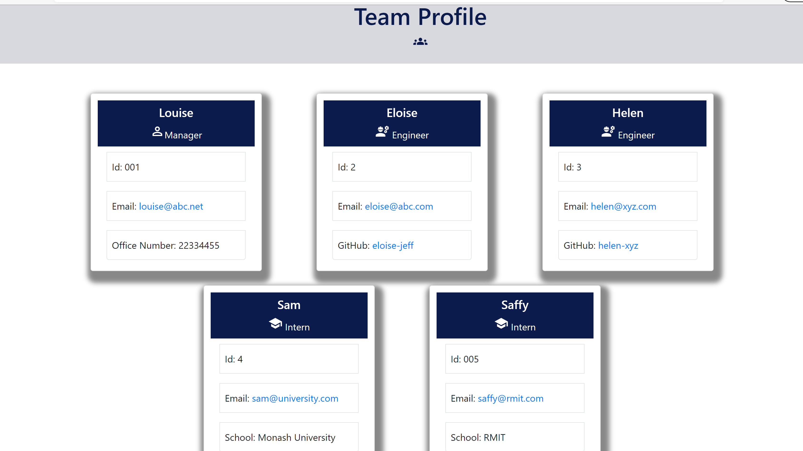

# Team-Profile-Generator 
## Overview

The Team Profile Generator gathers information about the members of a team from the command line and presents it in the form of a well styled HTML page. This is a CLI application built using node.js and the npm inquirer package. When the application is run from the command line, the user is prompted a few questions about the team members. 
The application also demonstrates the use of Object Oriented Programming and Test Driven Development concepts. Tests for this application are written using the Jest testing framework.

## User Story
```
AS A manager
I WANT to generate a webpage that displays my team's basic info
SO THAT I have quick access to their emails and GitHub profiles

```
## Acceptance Criteria
```
GIVEN a command-line application that accepts user input
WHEN I am prompted for my team members and their information
THEN an HTML file is generated that displays a nicely formatted team roster based on user input
WHEN I click on an email address in the HTML
THEN my default email program opens and populates the TO field of the email with the address
WHEN I click on the GitHub username
THEN that GitHub profile opens in a new tab
WHEN I start the application
THEN I am prompted to enter the team manager’s name, employee ID, email address, and office number
WHEN I enter the team manager’s name, employee ID, email address, and office number
THEN I am presented with a menu with the option to add an engineer or an intern or to finish building my team
WHEN I select the engineer option
THEN I am prompted to enter the engineer’s name, ID, email, and GitHub username, and I am taken back to the menu
WHEN I select the intern option
THEN I am prompted to enter the intern’s name, ID, email, and school, and I am taken back to the menu
WHEN I decide to finish building my team
THEN I exit the application, and the HTML is generated

```

## Table of Contents

- [Overview](#overview)
- [User Story](#user-story)
- [Acceptance Criteria](#acceptance-criteria)
- [Installation](#installation)
- [Usage](#usage)
- [Contributing](#contributing)
- [Questions](#questions)
- [Screenshot](#screenshot)
- [Walkthrough video](#walkthrough-video)

    ## Installation
   - Fork repository.
   - Should have access to Visual Studio and node.js.
   - Initialize npm by running "npm init".
   - Run npm install to install packages/dependencies (inquirer, fs).
   
    ## Usage
    To be prompted with questions about the project, from the directory where the project is located, run node index.js from the terminal. Provide all the required details and an index.html file will be generated in the /dist folder of the current working directory.
   
    ## Contributing
    Chaitra 
    
    ## Questions
    For any questions regarding the project please visit my 
    GitHub Profile @ 
    [chaitra-srinivas](https://github.com/dfdfgfd)
    or you can reach me @ cmurthy.dev@gmail.com
    
    ## Screenshot
    
    

    ## [Walkthrough video](https://youtu.be/E367cOkah00)


    Copyright © 2021 Chaitra Srinivasamurthy 
    